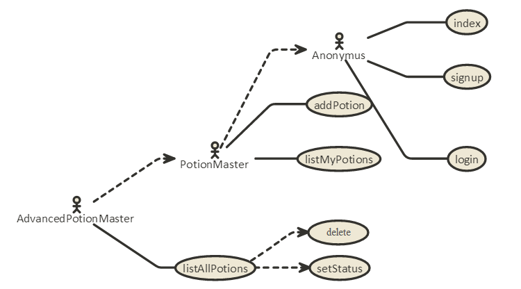

# Receptek dokumentáció

Alkalmazások fejlesztése beadandó v 1.0

Készítette: Galambos Krisztina Éva (gaktaai/TYHMTO)

#1. Követelményanalízis
##1.1. Célkitűzés, projektindító dokumentum

A projekt (beadandó) célja a szerveroldali technológiák megismerése és ezek kizárólagos felhasználásával egy egyszerű feladat megoldása.

Az általam választott téme a "Receptek és hozzávalók" téma átdolgozása bájitalokra. Az elkészítendő alkalmazás alapja egy receptgyűjtő weblap, ahol a felhasználó regisztráció után bejelentkezhet, bejelentkezés után beküldhet receptet,  majd módosíthatja a recept hozzávalóinak listáját. Minden általános felhasználó csak a saját receptjeihez fér hozzá.

Az adminjoggal rendelkező felhasználó ezen felül módosíthatja az egyes receptek állapotát: elfogadhatja, hogy az később bekerüljön a "kiadandó" bájitalos könyvbe, félreteheti későbbi döntésre, vagy elutasíthatja azt.

##1.2. Szakterületi fogalomjegyzék

**bold** - *italic*

##1.3. Használatieset-modell, funkcionális követelmények

Háromféle felhasználó van a modellben elkülönítve:

1. Anonymus: azonosítatlan felhasználó, aki megtekintheti a főoldalt, a regisztrációs felületet és a bejelentkezési felületet.
2. PotionMaster: bejelentkezett (azonosított) felhasználó, ún. "bájitalmester", aki mindent elér, amit az azonosítatlan felhasználó, valamint beküldhet receptet, szerkesztheti később annak hozzávalóinak listáját, hozzáfér az általa bekülött receptek listájához, valamint ki is tud jelentkezni.
3. AdvancedPotionMaster: adminjoggal rendelkező bájitalmester, aki a PotionMaster jogkörén túl képes a beküldött receptek osztályozására: elolvassa a receptet, majd vagy elfogadhatja, hogy az később bekerüljön a "kiadandó" bájitalos könyvbe, vagy félreteheti későbbi döntésre, vagy pedig elutasíthatja azt.

#2. Tervezés
#3. Implementáció
#4. Tesztelés
#5. Felhasználói dokumentáció
