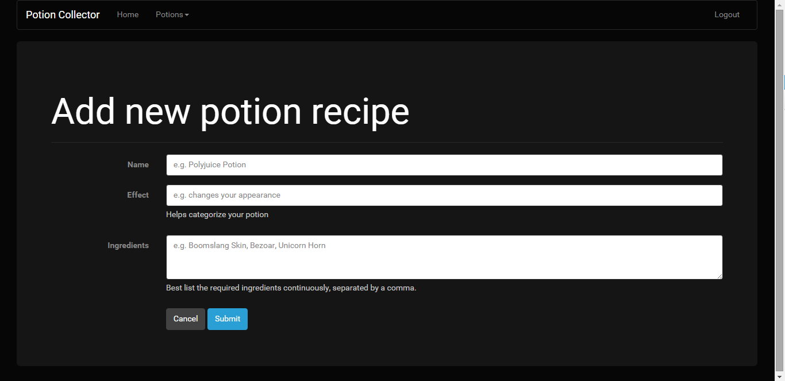

# Receptek dokumentáció

Alkalmazások fejlesztése beadandó v 1.0

Készítette: Galambos Krisztina Éva (gaktaai/TYHMTO)

#1. Követelményanalízis
##1.1. Célkitűzés, projektindító dokumentum

A projekt (beadandó) célja a szerveroldali technológiák megismerése és ezek kizárólagos felhasználásával egy egyszerű feladat megoldása.

Az általam választott téme a "Receptek és hozzávalók" téma átdolgozása bájitalokra. Az elkészítendő alkalmazás alapja egy receptgyűjtő weblap, ahol a felhasználó regisztráció után bejelentkezhet, bejelentkezés után beküldhet receptet,  majd módosíthatja a recept hozzávalóinak listáját. Minden általános felhasználó csak a saját receptjeihez fér hozzá.

Az adminjoggal rendelkező felhasználó ezen felül módosíthatja az egyes receptek állapotát: elfogadhatja, hogy az később bekerüljön a "kiadandó" bájitalos könyvbe, félreteheti későbbi döntésre, vagy elutasíthatja azt.

##1.2. Szakterületi fogalomjegyzék

Anonymus - *azonosítatlan felhasználó*

PotionMaster - *azonosított felhasználó, bájitalmester*

AdvancedPotionMaster - *azonosított felhasználó, admin, főbájitalmester*

autentikáció - *hitelesítés*

bcryptjs - *jelszó titkosító algoritmus beépülő modulja*

mocha, chai, zombijs - *teszt keretrendszerek a program szerkezeti és funcionális tesztelésére*

MVC -* model-view-control/modell-nézet-vezérlő: a szoftvertervezésben használatos szerkezeti minta. Összetett, sok adatot a felhasználó elé táró számítógépes alkalmazásokban gyakori fejlesztői kívánalom az adathoz (modell) és a felhasználói felülethez (nézet) tartozó dolgok szétválasztása, hogy a felhasználói felület ne befolyásolja az adatkezelést, és az adatok átszervezhetők legyenek a felhasználói felület változtatása nélkül. A modell-nézet-vezérlő ezt úgy éri el, hogy elkülöníti az adatok elérését és az üzleti logikát az adatok megjelenítésétől és a felhasználói interakciótól egy közbülső összetevő, a vezérlő bevezetésével.*

##1.3. Használatieset-modell, funkcionális követelmények

Szerepkörök:

1. Anonymus: azonosítatlan felhasználó, aki megtekintheti a főoldalt, a regisztrációs felületet és a bejelentkezési felületet.

2. PotionMaster: bejelentkezett (azonosított) felhasználó, ún. "bájitalmester", aki mindent elér, amit az azonosítatlan felhasználó, valamint beküldhet receptet, szerkesztheti később annak hozzávalóinak listáját, hozzáfér a bekülött receptek listájához, valamint ki is tud jelentkezni.

3. AdvancedPotionMaster: adminjoggal rendelkező bájitalmester, aki a potionMaster jogkörén túl képes a beküldött receptek osztályozására: elolvassa a receptet, majd vagy elfogadhatja, hogy az később bekerüljön a "kiadandó" bájitalos könyvbe, vagy félreteheti későbbi döntésre, vagy pedig elutasíthatja azt.

Egy kifejtett használati eset folyamatábrája:

Funkcionális követelmények:

1. felhasználóként szeretnék beküldeni egy bájital receptet --> recept beküldése,
2. felhasználóként szeretnék visszajelzést kapni, hogy a beküldött receptek milyen státuszban vannak --> receptek listázása,
3. felhasználóként szeretném egy esetleges hiba észrevételekor javítani a receptemet --> receptek szerkesztése,
4. adminként szeretném látni a receptlistát,
5. adminként szeretnék egy receptet megtekinteni és státuszát váltani,
6. a felhasználók és az adminok bejelentkezés után használhatják a funkciókat,
7. a főoldalon az alkalmazás ismertetése jelenik meg.

Nem funkcionális követelmények:

1. felhasználóbarát, ergonomikus elrendezés és kinézet,
2. gyors működés,
3. biztonságos működés: jelszavak kódolt tárolása, funkciókhoz való hozzáférés.

#2. Tervezés

##2.1. Architektúra terv

1. Oldaltérkép

    Anonymus:
    
    - Home
    - Signup
    - Login
    
    PotionMaster:
    
    - Home
    - Signup
    - Login/Logout
    - Potions
        + List potions
        + Add new potion
    
    AdvancedPotionMaster
    
    - Home
    - Signup
    - Login/Logout
    - Potions
        + List potions
        + Add new potion
        + Overview all potions
            * delete potion
            * edit potion
        
2. Végpontok

- GET / : főoldal
- GET /login/signup : bejelentkező oldal
- POST /login/signup : bejelentkezési adatok felküldése
- GET /login/login : regisztrációs oldal
- POST /login/login : regisztrációs adatok felküldése
- GET /potions/list : receptlista oldal
- GET /potions/new : új recept beküldése
- POST /potions/new : új recept beküldése, adatok küldése
- GET /potions/all : admin felület, receptlista
- GET /potions/all/edit/:id: recept adatai
- POST /potions/all/edit/:id: státuszállítás
- GET /potions/all/delete/:id: recept törlése

##2.2. Felhasználóifelület-modell

1. Oldalvázlatok, designtervek

##2.3. Osztálymodell
1. Adatmodell

    

2. Adatbázisterv

    
    
3. Állapotdiagram

    

#3. Implementáció

##3.1. Fejlesztői környezet bemutatása

A program fejlesztése során az alábbi fejlesztői környezeteket használtam:
1. gitHub - itt tárolódik a repository, azaz a gitHub szolgáltatja a tárhelyet az alkalmazásnak
2. cloud9 IDE - itt végeztem az aktuális kódolást, tesztelést az alábbi technológiák használatával: Node.js, Bootstrap CSS, express, routing (middlewares), hbs sablonok, sails és waterline (ORM), passport és bcryptjs az autentikációhoz, body-parser és flash a hibakezeléshez
3. heroku - ide töltöttem fel a bemutatandó applikációt

##3.2. Könyvtárstruktúrában lévő mappák funkciójának bemutatása

A "config" mappa a waterline ORM konfigurációs fájlját tartalmazza.

A "models", a "views" és a "controllers" mappák az MVC architektúrát valósítják meg, a "views" mappa almappái értelemszerűen különítik el a megjelenítési réteg egyes elemeit.

A "docs" mappa "images" almappája tárolja a jelen dokumentációban szereplő képeket, míg a "public" mappa "libs" almappája a HTML tartalom megjelenítéséhez szükséges bootstrap, bootswatch és jquery mappákat tartalmazza.

A ".tmp" mappa az adatbázis tárolására hivatott.

#4. Tesztelés

A tesztelés során az egységteszteláshez a mocha (és chai), a funcionális teszteléshez a zombie tesztrendszert használtam. A teszteléshez használj fájlok:

models/user.test.js

1. felhasználó létrehozása

2. felhasználó keresése

3. felhasználó adatainak (felhasználónevének) frissítése

controllers/index.test.js

1. felhasználó meglátogatja a főoldalt

2. felhasználó meglátogatja a recept beküldő oldalt, amihez

    2.1. átirányítódik a login oldalra
    
    2.2. be tud jelentkezni

#5. Felhasználói dokumentáció

A program futtatásához elegendő egy modern böngésző (IE 9+, Google Chrome, Mozilla Firefox, Opera, Safari) és a cloud9/heroku rendszer.

A program használata egyszerű: a megszokott módon regisztrálni kell a weboldalon (Sign up menü), a regisztráció után azonnal be lehet lépni (Login menü), és belépés után láthatóvá válik minden olyan felület, ami eddig a felhasználó számára láthatatlan volt.

Ilyenek a bájital receptek listája (Potions menü -> List of potions almenü) és az új receptek beküldésére (Potions menü -> Add new potion almenü) szolgáló aloldalak. A receptek listájában megjelennek a már eddig beküldött bájitalreceptek minden részletükkel: név, hatás, hozzávalók, feltöltés dátuma és státusz, ebben a sorrendben. Az új recept beküldése aloldal egy egyszerű űrlap: ki kell tölteni a megfelelő adatokkal a mezőket, melyek rendre: bájital neve, hatása és hozzávalói. Itt a "Submit" gombra kattintva küldhetjük fel az adatokat a szerverre, ami helytelen kitöltés esetén jelzi a hibát, helyes kitöltés esetén pedig megjeleníti az új receptet a listaoldalon.

Az admin számára van még egy extra oldal, ami minden más felhasználó előtt tiltott: az összes receptet kezelő felület (Potions menü -> Overview all potions almenü). Itt tudja a megfelelő recepteket kezelni: állítani az álltapotukat, vagy törölni őket. Ehhez a recepteket tartalmazó táblázat megfelelő sorában lévő "Edit" (szerkesztés) vagy "Delete" (törlés) gombjára kell kattintani.